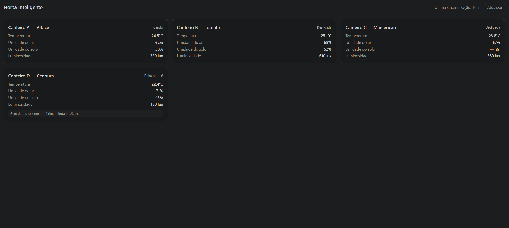

# Página — Dashboard Geral (WF-01 / UC-03)

| Campo | Valor |
|:------|:------|
| Entrega | A1.7 — uma tela do dashboard ponta a ponta com mock |
| Tela | WF-01 Dashboard Geral |
| Caso de uso | [UC-03 — Visualizar Status dos Canteiros](../requirementents/use-cases.md) |
| RFC | [rfc-001](../rfc/rfc-001-arquitetura-mvp.md) (ADR-003: React + API separada) |
| Estratégia de testes | [test-strategy.md](../test-strategy.md) (A1.6) |
| Código | `dashboard/` |

## 1. Tela escolhida e justificativa (por risco)

Escolhemos o **Dashboard Geral (WF-01)**, não por ser a mais fácil, mas porque concentra o **risco #1 da matriz A1.6**: a fronteira de fetch/contrato e o dashboard **não quebrar com campo nulo / dados ausentes**. O UC-03 é o caso de uso com mais estados de exceção especificados (E1–E5), e essa tela é a **fundação que as outras três replicam** (mesma camada de fetch, mesmos tipos, mesmo tratamento de estados). Fechar essa base reduz o risco do dashboard inteiro.

WF-02 (detalhe com gráficos) é a tela mais "assustadora" pela integração com Chart.js, mas a própria matriz A1.6 ranqueia o contrato de dados + tratamento de nulos acima do risco de visualização — e esse risco mora aqui.

## 2. Wireframe da versão implementada



```text
+-------------------------------------------------------------------+
| Horta Inteligente          Última sincronização: 14:35  [Atualizar] |
+-------------------------------------------------------------------+
| [Canteiro A — Alface]   Temp 24.5°C  Solo 38%  ...   Irrigando    |
| [Canteiro B — Tomate]   Temp 25.1°C  Solo 52%  ...   Desligada    |
| [Canteiro C — Manjeric.]Temp 23.8°C  Solo — ⚠  ...   (sensor falho)|
| [Canteiro D — Cenoura]  Temp 22.4°C  ...  "Sem dados recentes ..."  |
+-------------------------------------------------------------------+
```

## 3. Estados cobertos

- **Carregando:** skeleton dos cards enquanto a primeira busca não responde.
- **Sucesso:** grid de cards com temperatura, umidade do ar/solo, luminosidade e estado da irrigação.
- **API offline (E1):** mensagem "Não foi possível conectar ao servidor." + botão "Tentar novamente".
- **Polling falhou (E2):** mantém os últimos dados e mostra banner amarelo "Última atualização: {hora} — Sem conexão".
- **Dados desatualizados (E3):** card com leitura há >15 min exibe "Sem dados recentes — última leitura há {X} min".
- **Campo nulo / sensor falho (E4):** campo afetado mostra "— ⚠" com tooltip "Sensor com falha — verificar conexão".
- **Vazio (E5):** sem canteiros, exibe "Nenhum canteiro cadastrado.".

## 4. Estrutura do mock e plano de migração

- **Onde:** `dashboard/src/data/mocks/fixtures.ts` (`CANTEIROS_MOCK`, `LEITURAS_MOCK`).
- **Formato:** segue o contrato-alvo do UC-03/RFC (`canteiroId`, `temperatura`, `umidadeAr`, `umidadeSolo`, `luminosidade`, `timestamp`, `irrigacao`) — **não** o stub simplificado da API de referência da aula (`device_id`/`sensor`/`valor`).
- **Realismo:** temperaturas 22–26 °C, umidade do solo 30–60 %, luz 150–650 lux, timestamps recentes. Inclui de propósito 1 canteiro com sensor de solo nulo e 1 com leitura antiga (>15 min).
- **Camada isolada:** o app depende só da interface `DashboardClient`. Hoje, `MockDashboardClient`. A seleção fica em `dashboard/src/data/dashboardClient.ts`.
- **Migração para API real:** implementar `HttpDashboardClient` (mesma interface) chamando `GET /canteiros` + `GET /leituras/ultimas`, mapeando o JSON para os tipos de domínio, e selecioná-lo via `VITE_API_BASE_URL`. Nenhum componente muda.

## 5. Decisão de stack

React 18.3.1 + Vite 5.4.8 (ADR-003 da RFC). **Adições desta entrega:** TypeScript (contrato leitura/canteiro explícito em tipos), **Tailwind CSS** (muda a sugestão de CSS da RFC — decisão da equipe por velocidade no grid responsivo), estado só com hooks do React (sem Redux — YAGNI para uma tela). Chart.js permanece pinado na RFC, mas **não é usado** nesta tela (entra em WF-02). Testes com Vitest + React Testing Library.

## 6. Como rodar localmente

```bash
cd dashboard
npm install
npm run dev      # http://localhost:5173
npm run test     # suíte Vitest (6 testes)
```
