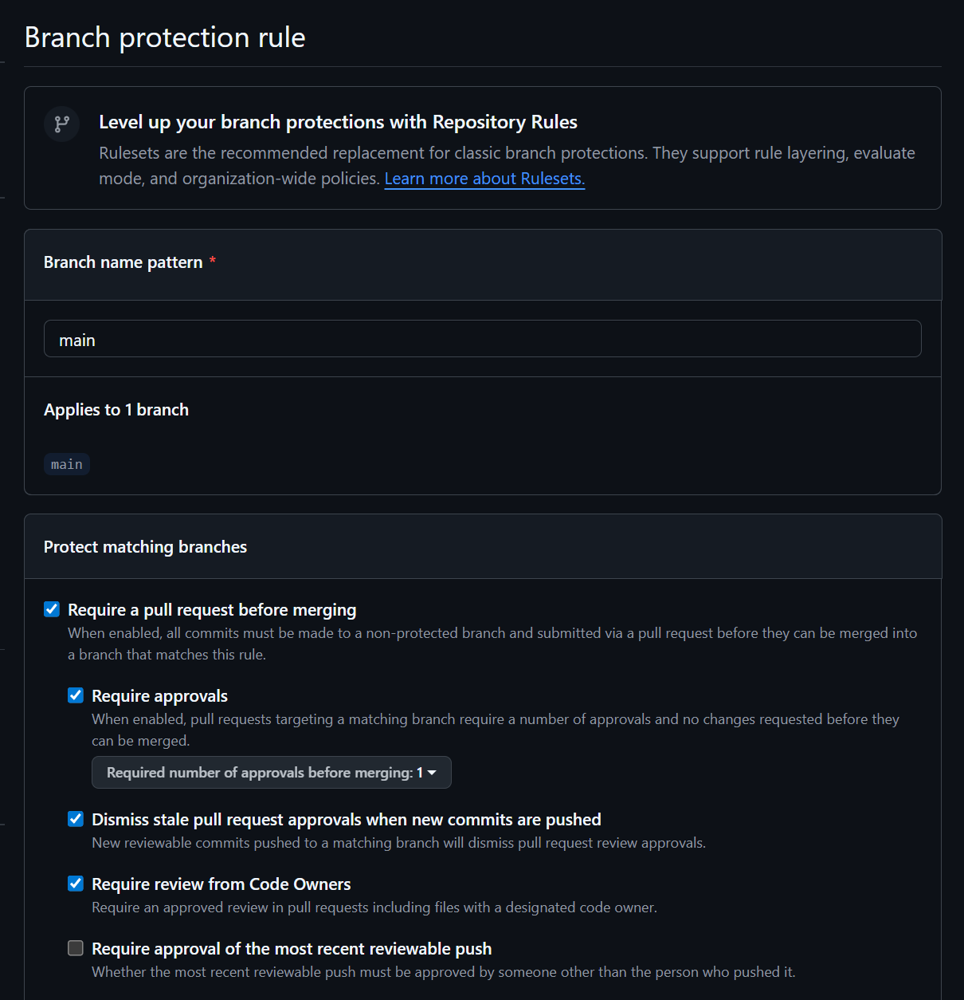
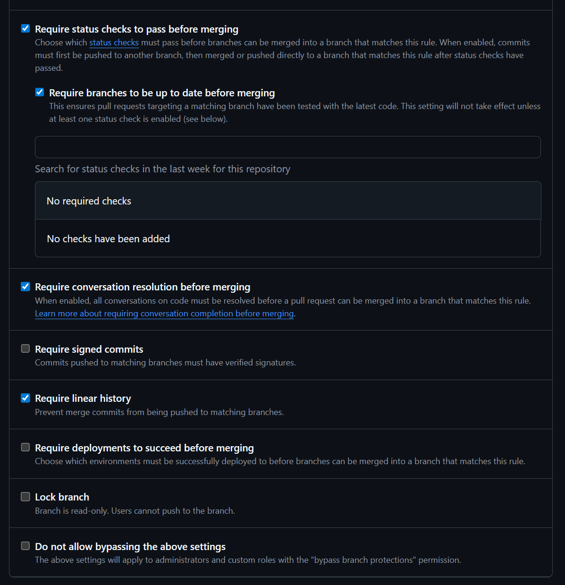

# Evidência da proteção da `main`

Este arquivo prova que as regras descritas em [`scm-plan.md`](scm-plan.md) §1.2 não são apenas teoria — elas estão efetivamente configuradas no GitHub e valendo para todo o time.

## Ruleset aplicado

Regras ativas em `main` (GitHub → Settings → Branches → Branch protection rule):

- ✅ **Require a pull request before merging**
  - ✅ Require approvals: **1**
  - ✅ Dismiss stale pull request approvals when new commits are pushed
- ✅ **Require status checks to pass before merging**
  - ✅ Require branches to be up to date before merging
  - Required status check: `placeholder` (job do workflow `.github/workflows/ci.yml`)
- ✅ **Require conversation resolution before merging**
- ✅ **Require linear history**
- ✅ **Do not allow force pushes**
- ✅ **Do not allow deletions**
- ✅ **Include administrators** — as regras valem inclusive para o dono do repo

Coerência conferida com `scm-plan.md` §1.2: sim, cada item da proteção corresponde a uma regra documentada.

## Data de aplicação

_(preencher após aplicar as regras no GitHub — formato: AAAA-MM-DD, por Leonardo)_

## Screenshot

_(anexar print de `Settings → Branches → Branch protection rules` mostrando as regras ativas em `main`)_

## Como reproduzir a verificação

Qualquer membro do time pode confirmar a aplicação das regras assim:

1. Abrir o repositório no GitHub e ir em **Settings → Branches**.
2. Conferir se existe regra de proteção para `main` com os itens listados acima.
3. Tentar abrir um PR em `main` sem aprovação — o botão de merge deve estar bloqueado.
